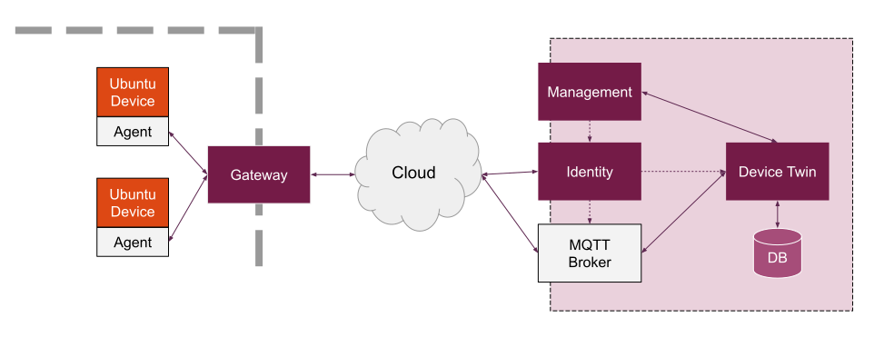

# IoT Device Twin Service

The Device Twin service holds information about the state of the connected devices. Once a 
device is registered in the IoT Identity Service, a device twin it created to hold
the current and desired state of the device.

The device twin record holds:
 - Summary of the device
 - Last known heartbeat from the device
 - The groups that the device belongs to
 - Details about the device's state
 - Details about the device's desired state
 
 The service provides a cache so the devices can be monitored by the [IoT Management](https://github.com/CanonicalLtd/iot-management) 
 Service, and relays actions to the device [IoT agent](https://github.com/CanonicalLtd/iot-agent) e.g. to install a new application.
 
## Design

 
## Build
```bash
go build -o devicetwin bin/devicetwin/devicetwin.go
```

## Configuration

Default values are loaded first. Those can be seen [here](./config/config.go) in `defaultValues`.

Configuration can be provided by configuration yaml or environment variables. The configuration file path
is specified by an environment variable `CONFIG_FILE_PATH`. It will also look in the current directory by
default without specifying anything. If it finds a `config.yaml` then it will load those values. 

Environment variables will override any previous specified values.  Environment variables are the
YAML keys in uppercase with periods replaced with underscores and prefaced with IOTDEVICETWIN_. Ex. `database.driver`
becomes `IOTDEVICETWIN_DATABASE_DRIVER` as an environment variable. Additional examples can be seen in the Kubernetes 
YAML [here](./deploy/pods/k8s-devicetwin.yaml).

### Keys

Keys and descriptions can be found [here](./config/keys/keys.go).

## Run
```bash
go run bin/devicetwin/devicetwin.go 
```
 
The service connects to the MQTT Broker using the certificates found in the directory specified by the `service.certificates.path` value.
Its default value is `/srv/certs`. The filenames of the certificates have default values of `ca.crt`, `server.crt` and `server.key`. They can
be modified by setting the values for `mqtt.root.ca.filename`, `mqtt.client.certificate.filename` and `mqtt.client.key.filename` respectively.
